# Ethereum Wallet Multisig Test

This GitHub repository contains the documentation on some testing of the Ethereum Wallet (Foundation) Multisig.

This testing will be performed on the Ropsten network using the following accounts:

* AAA - [0xaaAed70fA30bf42B1620D0765276B0cCaDd914CF](https://ropsten.etherscan.io/address/0xaaAed70fA30bf42B1620D0765276B0cCaDd914CF)
* BBB - [0xbBBb05D4eC67bAe183a59232D5Cd24f4b949C369](https://ropsten.etherscan.io/address/0xbBBb05D4eC67bAe183a59232D5Cd24f4b949C369)
* CCC - [0xCcCc51A144eFa3f7F0BE4Cf6D7020A455a8aA375](https://ropsten.etherscan.io/address/0xCcCc51A144eFa3f7F0BE4Cf6D7020A455a8aA375)
* DDD - [0xdddBC0B42A0910be647550d99b5defF28b6Fb97b](https://ropsten.etherscan.io/address/0xdddBC0B42A0910be647550d99b5defF28b6Fb97b)

This testing will be performed from the Ethereum Wallet and Mist applications.

From my testing, changing the parameters of the Ethereum Wallet multisig cannot be achieved. See bugs:

* [Want to change Multisig Daily Limit #162](https://github.com/ethereum/mist/issues/162)
* [Very very hard to change parameters #157](https://github.com/ethereum/meteor-dapp-wallet/issues/157)

<br />

<hr />

## Table Of Contents

<br />

<hr />

## Function Hashes

From Remix:

* "52375093": "m_lastDay()",
* "7065cb48": "addOwner(address)",
* "f00d4b5d": "changeOwner(address,address)",
* "ba51a6df": "changeRequirement(uint256)",
* "797af627": "confirm(bytes32)",
* "b61d27f6": "execute(address,uint256,bytes)"
* "c2cf7326": "hasConfirmed(bytes32,address)",
* "2f54bf6e": "isOwner(address)",
* "f1736d86": "m_dailyLimit()",
* "4123cb6b": "m_numOwners()",
* "746c9171": "m_required()",
* "659010e7": "m_spentToday()",
* "173825d9": "removeOwner(address)",
* "5c52c2f5": "resetSpentToday()",
* "b75c7dc6": "revoke(bytes32)",
* "b20d30a9": "setDailyLimit(uint256)"

<br />

<hr />

## Events

Following are the events emitted by the multisig smart contract

* `event Confirmation(address owner, bytes32 operation)`

  `web3.sha3("Confirmation(address,bytes32)")` => `0xe1c52dc63b719ade82e8bea94cc41a0d5d28e4aaf536adb5e9cccc9ff8c1aeda`
* `event Revoke(address owner, bytes32 operation)`

  `web3.sha3("Revoke(address,bytes32)")` => `0xc7fb647e59b18047309aa15aad418e5d7ca96d173ad704f1031a2c3d7591734b`
* `event OwnerChanged(address oldOwner, address newOwner)`

  `web3.sha3("OwnerChanged(address,address)")` => `0xb532073b38c83145e3e5135377a08bf9aab55bc0fd7c1179cd4fb995d2a5159c`
* `event OwnerAdded(address newOwner)`

  `web3.sha3("OwnerAdded(address)")` => `0x994a936646fe87ffe4f1e469d3d6aa417d6b855598397f323de5b449f765f0c3`
* `event OwnerRemoved(address oldOwner)`

  `web3.sha3("OwnerRemoved(address)")` => `0x58619076adf5bb0943d100ef88d52d7c3fd691b19d3a9071b555b651fbf418da`
* `event RequirementChanged(uint newRequirement)`

  `web3.sha3("RequirementChanged(uint256)")` => `0xacbdb084c721332ac59f9b8e392196c9eb0e4932862da8eb9beaf0dad4f550da`
* `event Deposit(address from, uint value)`

  `web3.sha3("Deposit(address,uint256)")` => `0xe1fffcc4923d04b559f4d29a8bfc6cda04eb5b0d3c460751c2402c5c5cc9109c`
* `event SingleTransact(address owner, uint value, address to, bytes data)`

  `web3.sha3("SingleTransact(address,uint256,address,bytes)")` => `0x92ca3a80853e6663fa31fa10b99225f18d4902939b4c53a9caae9043f6efd004`
* `event MultiTransact(address owner, bytes32 operation, uint value, address to, bytes data)`

  `web3.sha3("MultiTransact(address,bytes32,uint256,address,bytes)")` => `0xe7c957c06e9a662c1a6c77366179f5b702b97651dc28eee7d5bf1dff6e40bb4a`
* `event ConfirmationNeeded(bytes32 operation, address initiator, uint value, address to, bytes data)`

  `web3.sha3("ConfirmationNeeded(bytes32,address,uint256,address,bytes)")` => `0x1733cbb53659d713b79580f79f3f9ff215f78a7c7aa45890f3b89fc5cddfbf32`

<br />

<hr />

## Setting Up The Multisig With Three Owners

### Setup Options

3 owners AAA, BBB and CCC with 2 required signatures to confirm any transaction and a 10 ETH daily limit.

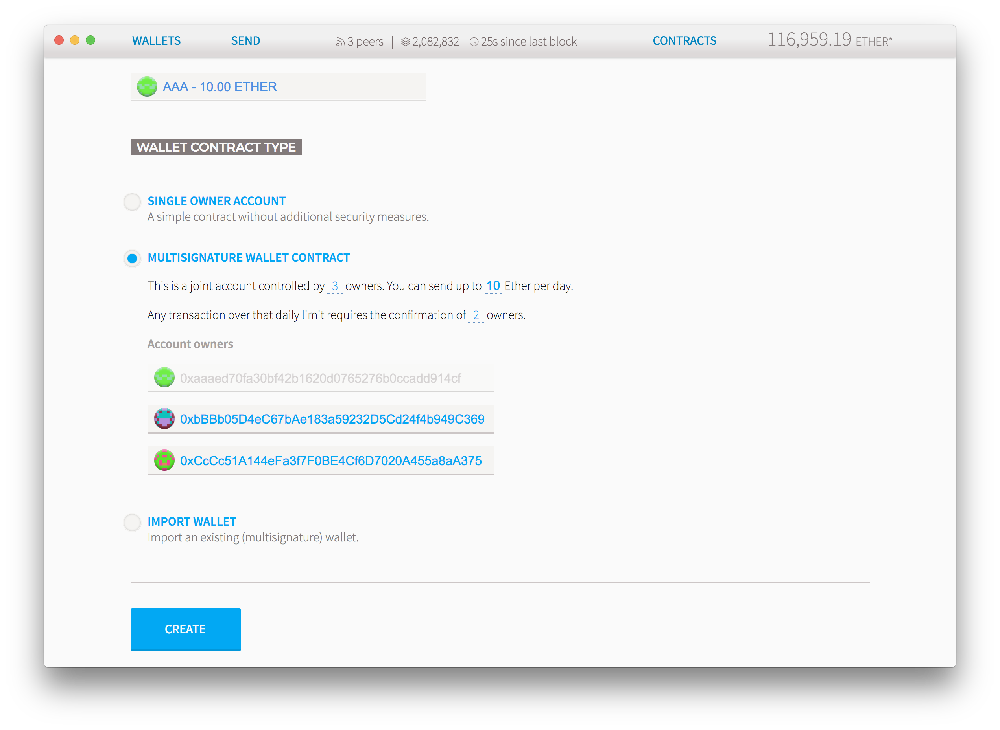

<br />

### Sending Transaction

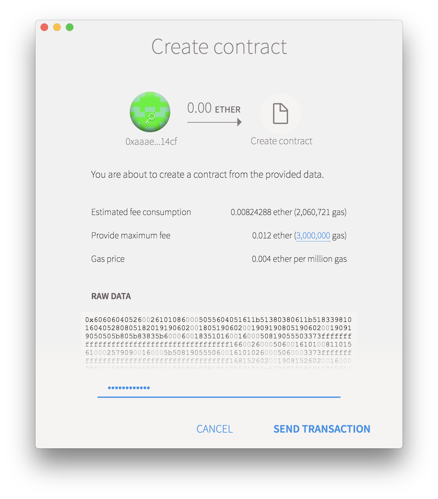

<br />

### Created Wallet

Wallet created at 0x52F2b65681b3b78e862436Bd38E8e9ab4fF0da96

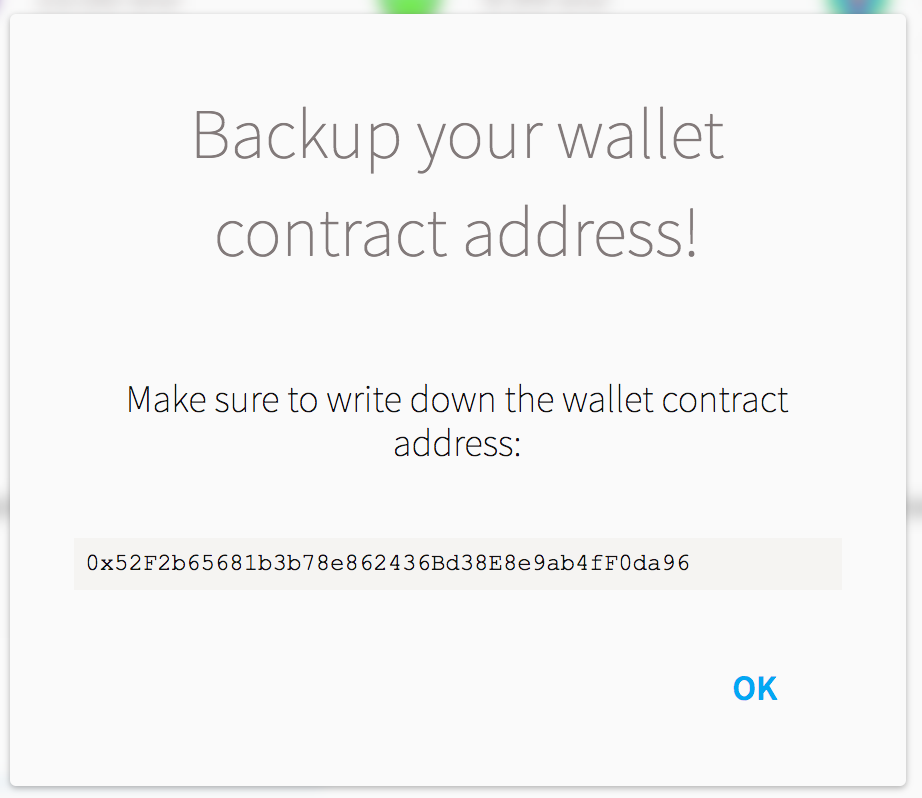

Tx [0x9d6ea01666449592ea927a136a04870550bd43ee078b74c5022917d978618943](https://ropsten.etherscan.io/tx/0x9d6ea01666449592ea927a136a04870550bd43ee078b74c5022917d978618943)


<br />

### Send ETH To Multisig

Sending 15 ETH to the multisig in tx [0x748997ba6176f1f4e6f7a6e44ffb3686a6b50a0e9e5855633d4abc5f7e3418f1](https://ropsten.etherscan.io/tx/0x748997ba6176f1f4e6f7a6e44ffb3686a6b50a0e9e5855633d4abc5f7e3418f1)

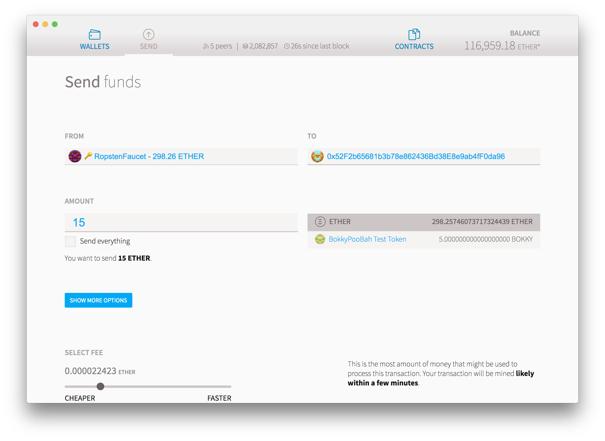

### Multisig With 15 ETH

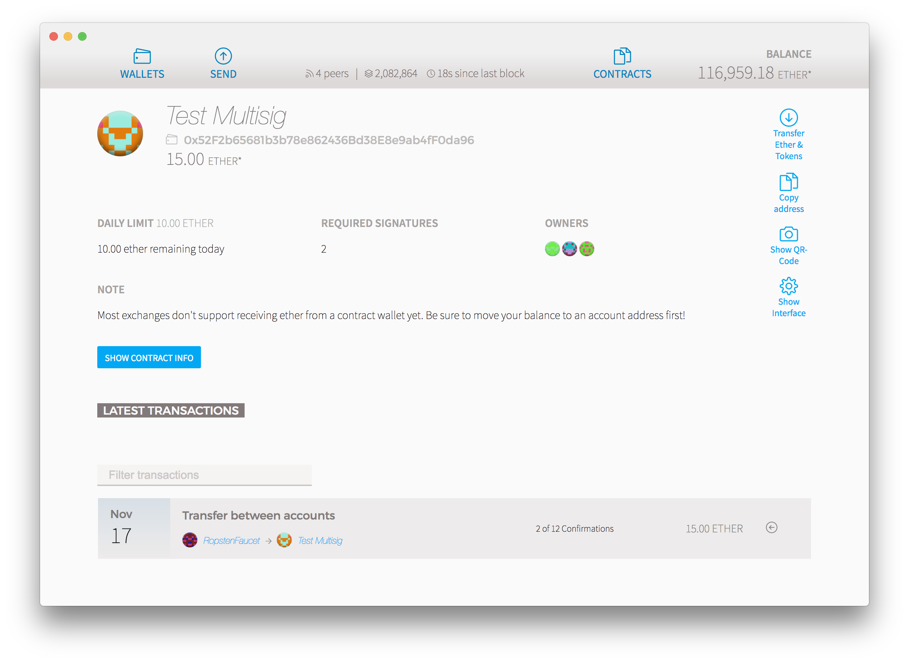

<br />

### Import Multisig Into Mist

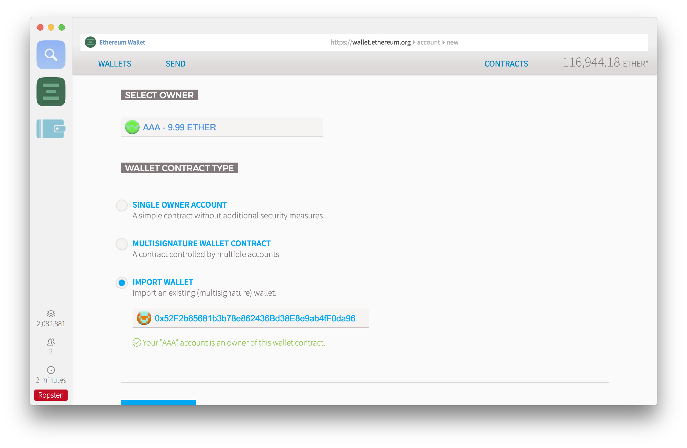

<br />

### Change Daily Limit To 1 ETH

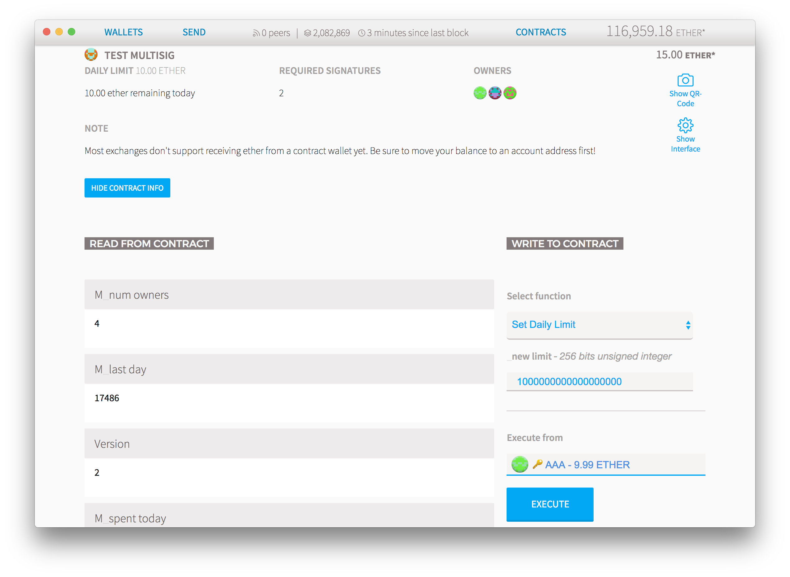

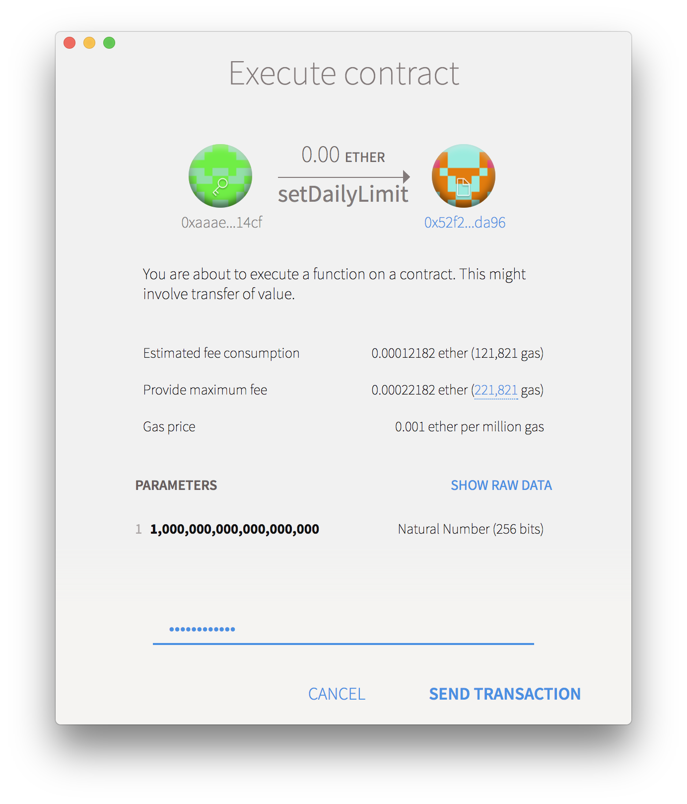

Tx [0xba639889f2031c4c3abc558a7d97ebf8ea0547eca0fd36aeaa76cb2e07179833](https://ropsten.etherscan.io/tx/0xba639889f2031c4c3abc558a7d97ebf8ea0547eca0fd36aeaa76cb2e07179833)

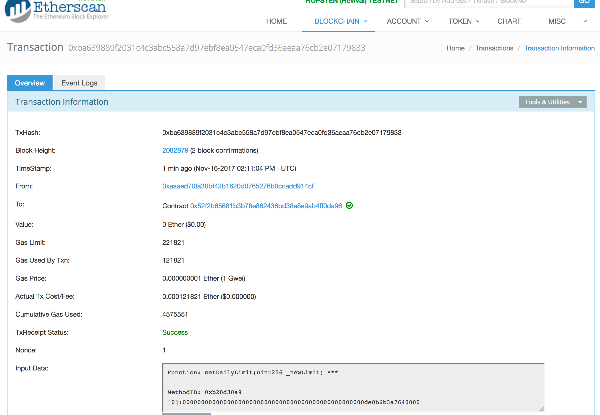

Click on the Event Log tab

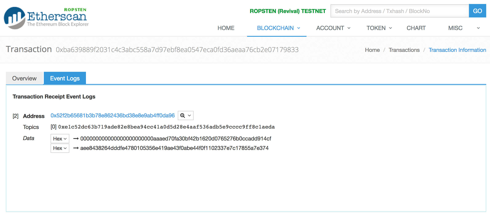

Note that:

* The topic `0xe1c52dc63b719ade82e8bea94cc41a0d5d28e4aaf536adb5e9cccc9ff8c1aeda` represents the `Confirmation(address owner, bytes32 operation)` event
* The first event parameter `000000000000000000000000aaaed70fa30bf42b1620d0765276b0ccadd914cf` is the address of AAA that sent the tx
* The second event parameter `aee8438264dddfe4780105356e419ae43f0abe44f0f1102337e7c17855a7e374` is a hash of the tx that needs to be confirmed by
  another owner account

<br />

### Confirm Change Daily Limit To 1 ETH

From Mist, confirm the multisig tx with hash `aee8438264dddfe4780105356e419ae43f0abe44f0f1102337e7c17855a7e374` by account BBB:

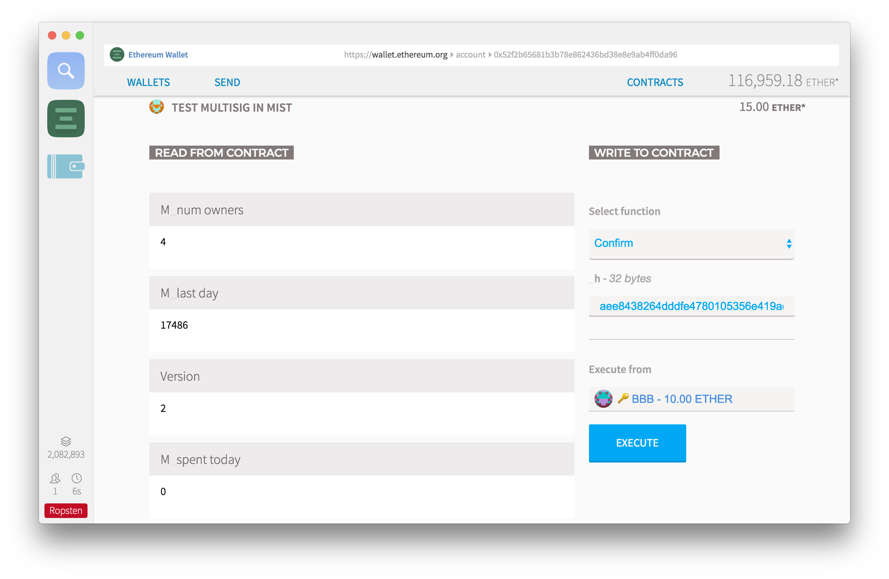

Send transaction

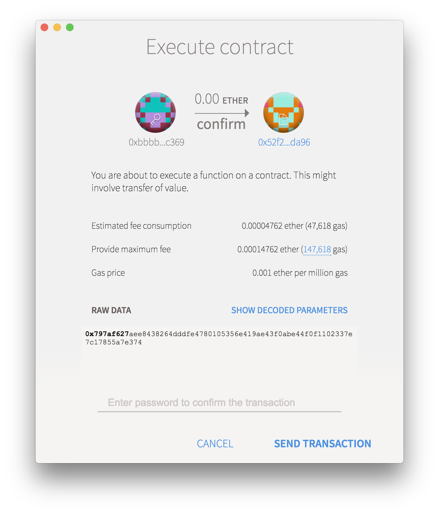

Tx [0x14eacfb0487adc25ad0642387ed3baf924d1b903dd09ed20e0cb08a66d722ef0](https://ropsten.etherscan.io/tx/0x14eacfb0487adc25ad0642387ed3baf924d1b903dd09ed20e0cb08a66d722ef0):

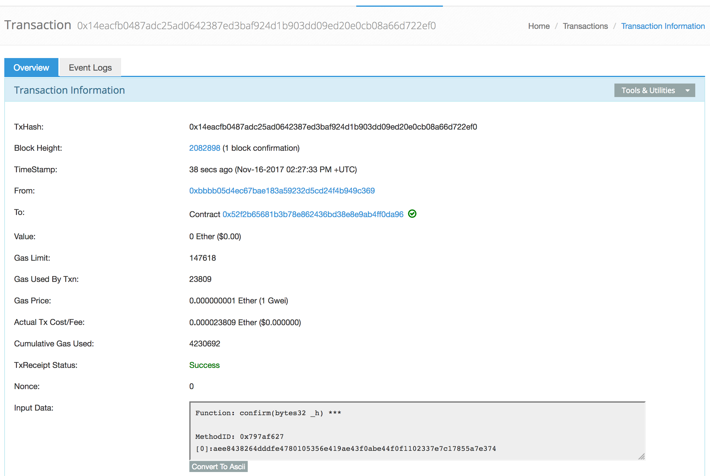

Click on the Event Log tab

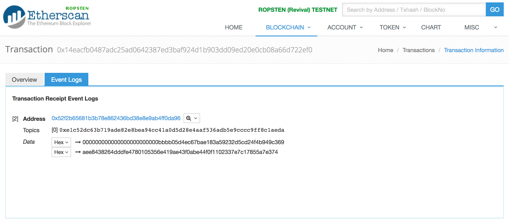

Note that:

* The topic `0xe1c52dc63b719ade82e8bea94cc41a0d5d28e4aaf536adb5e9cccc9ff8c1aeda` represents the `Confirmation(address owner, bytes32 operation)` event
* The first event parameter `000000000000000000000000bbbb05d4ec67bae183a59232d5cd24f4b949c369` is the address of BBB that sent the tx
* The second event parameter `aee8438264dddfe4780105356e419ae43f0abe44f0f1102337e7c17855a7e374` is a hash of the tx that needs to be confirmed by
  another owner account

<br />


<br />

<hr />

## Ethereum Wallet Multisig Source Code

From [0x52f2b65681b3b78e862436bd38e8e9ab4ff0da96](https://ropsten.etherscan.io/address/0x52f2b65681b3b78e862436bd38e8e9ab4ff0da96#code):

Compiled with Solidity v0.3.1-nightly.2016.4.18+commit.81ae2a7 with optimisation disabled.

```javascript
//sol Wallet
// Multi-sig, daily-limited account proxy/wallet.
// @authors:
// Gav Wood <g@ethdev.com>
// inheritable "property" contract that enables methods to be protected by requiring the acquiescence of either a
// single, or, crucially, each of a number of, designated owners.
// usage:
// use modifiers onlyowner (just own owned) or onlymanyowners(hash), whereby the same hash must be provided by
// some number (specified in constructor) of the set of owners (specified in the constructor, modifiable) before the
// interior is executed.
contract multiowned {

    // TYPES

    // struct for the status of a pending operation.
    struct PendingState {
        uint yetNeeded;
        uint ownersDone;
        uint index;
    }

    // EVENTS

    // this contract only has five types of events: it can accept a confirmation, in which case
    // we record owner and operation (hash) alongside it.
    event Confirmation(address owner, bytes32 operation);
    event Revoke(address owner, bytes32 operation);
    // some others are in the case of an owner changing.
    event OwnerChanged(address oldOwner, address newOwner);
    event OwnerAdded(address newOwner);
    event OwnerRemoved(address oldOwner);
    // the last one is emitted if the required signatures change
    event RequirementChanged(uint newRequirement);

    // MODIFIERS

    // simple single-sig function modifier.
    modifier onlyowner {
        if (isOwner(msg.sender))
            _
    }
    // multi-sig function modifier: the operation must have an intrinsic hash in order
    // that later attempts can be realised as the same underlying operation and
    // thus count as confirmations.
    modifier onlymanyowners(bytes32 _operation) {
        if (confirmAndCheck(_operation))
            _
    }

    // METHODS

    // constructor is given number of sigs required to do protected "onlymanyowners" transactions
    // as well as the selection of addresses capable of confirming them.
    function multiowned(address[] _owners, uint _required) {
        m_numOwners = _owners.length + 1;
        m_owners[1] = uint(msg.sender);
        m_ownerIndex[uint(msg.sender)] = 1;
        for (uint i = 0; i < _owners.length; ++i)
        {
            m_owners[2 + i] = uint(_owners[i]);
            m_ownerIndex[uint(_owners[i])] = 2 + i;
        }
        m_required = _required;
    }
    
    // Revokes a prior confirmation of the given operation
    function revoke(bytes32 _operation) external {
        uint ownerIndex = m_ownerIndex[uint(msg.sender)];
        // make sure they're an owner
        if (ownerIndex == 0) return;
        uint ownerIndexBit = 2**ownerIndex;
        var pending = m_pending[_operation];
        if (pending.ownersDone & ownerIndexBit > 0) {
            pending.yetNeeded++;
            pending.ownersDone -= ownerIndexBit;
            Revoke(msg.sender, _operation);
        }
    }
    
    // Replaces an owner `_from` with another `_to`.
    function changeOwner(address _from, address _to) onlymanyowners(sha3(msg.data, block.number)) external {
        if (isOwner(_to)) return;
        uint ownerIndex = m_ownerIndex[uint(_from)];
        if (ownerIndex == 0) return;

        clearPending();
        m_owners[ownerIndex] = uint(_to);
        m_ownerIndex[uint(_from)] = 0;
        m_ownerIndex[uint(_to)] = ownerIndex;
        OwnerChanged(_from, _to);
    }
    
    function addOwner(address _owner) onlymanyowners(sha3(msg.data, block.number)) external {
        if (isOwner(_owner)) return;

        clearPending();
        if (m_numOwners >= c_maxOwners)
            reorganizeOwners();
        if (m_numOwners >= c_maxOwners)
            return;
        m_numOwners++;
        m_owners[m_numOwners] = uint(_owner);
        m_ownerIndex[uint(_owner)] = m_numOwners;
        OwnerAdded(_owner);
    }
    
    function removeOwner(address _owner) onlymanyowners(sha3(msg.data, block.number)) external {
        uint ownerIndex = m_ownerIndex[uint(_owner)];
        if (ownerIndex == 0) return;
        if (m_required > m_numOwners - 1) return;

        m_owners[ownerIndex] = 0;
        m_ownerIndex[uint(_owner)] = 0;
        clearPending();
        reorganizeOwners(); //make sure m_numOwner is equal to the number of owners and always points to the optimal free slot
        OwnerRemoved(_owner);
    }
    
    function changeRequirement(uint _newRequired) onlymanyowners(sha3(msg.data, block.number)) external {
        if (_newRequired > m_numOwners) return;
        m_required = _newRequired;
        clearPending();
        RequirementChanged(_newRequired);
    }
    
    function isOwner(address _addr) returns (bool) {
        return m_ownerIndex[uint(_addr)] > 0;
    }
    
    function hasConfirmed(bytes32 _operation, address _owner) constant returns (bool) {
        var pending = m_pending[_operation];
        uint ownerIndex = m_ownerIndex[uint(_owner)];

        // make sure they're an owner
        if (ownerIndex == 0) return false;

        // determine the bit to set for this owner.
        uint ownerIndexBit = 2**ownerIndex;
        if (pending.ownersDone & ownerIndexBit == 0) {
            return false;
        } else {
            return true;
        }
    }
    
    // INTERNAL METHODS

    function confirmAndCheck(bytes32 _operation) internal returns (bool) {
        // determine what index the present sender is:
        uint ownerIndex = m_ownerIndex[uint(msg.sender)];
        // make sure they're an owner
        if (ownerIndex == 0) return;

        var pending = m_pending[_operation];
        // if we're not yet working on this operation, switch over and reset the confirmation status.
        if (pending.yetNeeded == 0) {
            // reset count of confirmations needed.
            pending.yetNeeded = m_required;
            // reset which owners have confirmed (none) - set our bitmap to 0.
            pending.ownersDone = 0;
            pending.index = m_pendingIndex.length++;
            m_pendingIndex[pending.index] = _operation;
        }
        // determine the bit to set for this owner.
        uint ownerIndexBit = 2**ownerIndex;
        // make sure we (the message sender) haven't confirmed this operation previously.
        if (pending.ownersDone & ownerIndexBit == 0) {
            Confirmation(msg.sender, _operation);
            // ok - check if count is enough to go ahead.
            if (pending.yetNeeded <= 1) {
                // enough confirmations: reset and run interior.
                delete m_pendingIndex[m_pending[_operation].index];
                delete m_pending[_operation];
                return true;
            }
            else
            {
                // not enough: record that this owner in particular confirmed.
                pending.yetNeeded--;
                pending.ownersDone |= ownerIndexBit;
            }
        }
    }

    function reorganizeOwners() private returns (bool) {
        uint free = 1;
        while (free < m_numOwners)
        {
            while (free < m_numOwners && m_owners[free] != 0) free++;
            while (m_numOwners > 1 && m_owners[m_numOwners] == 0) m_numOwners--;
            if (free < m_numOwners && m_owners[m_numOwners] != 0 && m_owners[free] == 0)
            {
                m_owners[free] = m_owners[m_numOwners];
                m_ownerIndex[m_owners[free]] = free;
                m_owners[m_numOwners] = 0;
            }
        }
    }
    
    function clearPending() internal {
        uint length = m_pendingIndex.length;
        for (uint i = 0; i < length; ++i)
            if (m_pendingIndex[i] != 0)
                delete m_pending[m_pendingIndex[i]];
        delete m_pendingIndex;
    }
        
    // FIELDS

    // the number of owners that must confirm the same operation before it is run.
    uint public m_required;
    // pointer used to find a free slot in m_owners
    uint public m_numOwners;
    
    // list of owners
    uint[256] m_owners;
    uint constant c_maxOwners = 250;
    // index on the list of owners to allow reverse lookup
    mapping(uint => uint) m_ownerIndex;
    // the ongoing operations.
    mapping(bytes32 => PendingState) m_pending;
    bytes32[] m_pendingIndex;
}

// inheritable "property" contract that enables methods to be protected by placing a linear limit (specifiable)
// on a particular resource per calendar day. is multiowned to allow the limit to be altered. resource that method
// uses is specified in the modifier.
contract daylimit is multiowned {

    // MODIFIERS

    // simple modifier for daily limit.
    modifier limitedDaily(uint _value) {
        if (underLimit(_value))
            _
    }

    // METHODS

    // constructor - stores initial daily limit and records the present day's index.
    function daylimit(uint _limit) {
        m_dailyLimit = _limit;
        m_lastDay = today();
    }
    // (re)sets the daily limit. needs many of the owners to confirm. doesn't alter the amount already spent today.
    function setDailyLimit(uint _newLimit) onlymanyowners(sha3(msg.data, block.number)) external {
        m_dailyLimit = _newLimit;
    }
    // (re)sets the daily limit. needs many of the owners to confirm. doesn't alter the amount already spent today.
    function resetSpentToday() onlymanyowners(sha3(msg.data, block.number)) external {
        m_spentToday = 0;
    }
    
    // INTERNAL METHODS
    
    // checks to see if there is at least `_value` left from the daily limit today. if there is, subtracts it and
    // returns true. otherwise just returns false.
    function underLimit(uint _value) internal onlyowner returns (bool) {
        // reset the spend limit if we're on a different day to last time.
        if (today() > m_lastDay) {
            m_spentToday = 0;
            m_lastDay = today();
        }
        // check to see if there's enough left - if so, subtract and return true.
        if (m_spentToday + _value >= m_spentToday && m_spentToday + _value <= m_dailyLimit) {
            m_spentToday += _value;
            return true;
        }
        return false;
    }
    // determines today's index.
    function today() private constant returns (uint) { return now / 1 days; }

    // FIELDS

    uint public m_dailyLimit;
    uint public m_spentToday;
    uint public m_lastDay;
}

// interface contract for multisig proxy contracts; see below for docs.
contract multisig {

    // EVENTS

    // logged events:
    // Funds has arrived into the wallet (record how much).
    event Deposit(address from, uint value);
    // Single transaction going out of the wallet (record who signed for it, how much, and to whom it's going).
    event SingleTransact(address owner, uint value, address to, bytes data);
    // Multi-sig transaction going out of the wallet (record who signed for it last, the operation hash, how much, and to whom it's going).
    event MultiTransact(address owner, bytes32 operation, uint value, address to, bytes data);
    // Confirmation still needed for a transaction.
    event ConfirmationNeeded(bytes32 operation, address initiator, uint value, address to, bytes data);
    
    // FUNCTIONS
    
    // TODO: document
    function changeOwner(address _from, address _to) external;
    function execute(address _to, uint _value, bytes _data) external returns (bytes32);
    function confirm(bytes32 _h) returns (bool);
}

// usage:
// bytes32 h = Wallet(w).from(oneOwner).transact(to, value, data);
// Wallet(w).from(anotherOwner).confirm(h);
contract Wallet is multisig, multiowned, daylimit {

    uint public version = 2;

    // TYPES

    // Transaction structure to remember details of transaction lest it need be saved for a later call.
    struct Transaction {
        address to;
        uint value;
        bytes data;
    }

    // METHODS

    // constructor - just pass on the owner array to the multiowned and
    // the limit to daylimit
    function Wallet(address[] _owners, uint _required, uint _daylimit)
            multiowned(_owners, _required) daylimit(_daylimit) {
    }
    
    // kills the contract sending everything to `_to`.
    function kill(address _to) onlymanyowners(sha3(msg.data, block.number)) external {
        suicide(_to);
    }
    
    // gets called when no other function matches
    function() {
        // just being sent some cash?
        if (msg.value > 0)
            Deposit(msg.sender, msg.value);
    }
    
    // Outside-visible transact entry point. Executes transacion immediately if below daily spend limit.
    // If not, goes into multisig process. We provide a hash on return to allow the sender to provide
    // shortcuts for the other confirmations (allowing them to avoid replicating the _to, _value
    // and _data arguments). They still get the option of using them if they want, anyways.
    function execute(address _to, uint _value, bytes _data) external onlyowner returns (bytes32 _r) {
        // first, take the opportunity to check that we're under the daily limit.
        if (underLimit(_value)) {
            SingleTransact(msg.sender, _value, _to, _data);
            // yes - just execute the call.
            _to.call.value(_value)(_data);
            return 0;
        }
        // determine our operation hash.
        _r = sha3(msg.data, block.number);
        if (!confirm(_r) && m_txs[_r].to == 0) {
            m_txs[_r].to = _to;
            m_txs[_r].value = _value;
            m_txs[_r].data = _data;
            ConfirmationNeeded(_r, msg.sender, _value, _to, _data);
        }
    }
    
    // confirm a transaction through just the hash. we use the previous transactions map, m_txs, in order
    // to determine the body of the transaction from the hash provided.
    function confirm(bytes32 _h) onlymanyowners(_h) returns (bool) {
        if (m_txs[_h].to != 0) {
            m_txs[_h].to.call.value(m_txs[_h].value)(m_txs[_h].data);
            MultiTransact(msg.sender, _h, m_txs[_h].value, m_txs[_h].to, m_txs[_h].data);
            delete m_txs[_h];
            return true;
        }
    }
    
    // INTERNAL METHODS
    
    function clearPending() internal {
        uint length = m_pendingIndex.length;
        for (uint i = 0; i < length; ++i)
            delete m_txs[m_pendingIndex[i]];
        super.clearPending();
    }

    // FIELDS

    // pending transactions we have at present.
    mapping (bytes32 => Transaction) m_txs;
}
```
